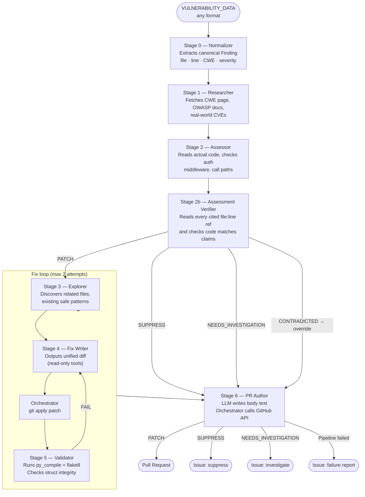

# auto-security-patch

An AI-powered pipeline that takes a raw security vulnerability report — in any format — and automatically produces a GitHub pull request with a fix, or an issue with a suppression/investigation recommendation. All output requires human review before merging.

## How it works

A vulnerability blob (Bandit JSON, SARIF, plain text, or anything else) is passed to a 7-stage Claude agent pipeline. Each stage has a narrowly scoped set of tools and produces structured output for the next stage. The orchestrator handles all git/GitHub operations — agents never write files or call APIs directly.



## Security model

The pipeline is designed for minimal blast radius:

- **Tool restrictions**: each stage's Claude API call only receives the tool schemas it needs — the model cannot call a tool outside its allowlist (enforced at the API level)
- **Sandboxed filesystem access**: all file reads/writes operate on a temp-dir clone of the target repo; path traversal is rejected by resolving against the sandbox root
- **No shell=True anywhere**: subprocess calls use list args throughout
- **SSRF protection**: `web_fetch` validates URLs against RFC 1918/link-local/loopback ranges before connecting
- **Token redaction**: GitHub tokens are stripped from error messages before logging
- **Human oversight always**: output is PRs and issues — nothing is auto-merged

## Usage

### GitHub Actions (recommended)

Trigger manually from the **Actions** tab, or call from another workflow:

```yaml
# In another workflow:
jobs:
  patch:
    uses: adzerk/auto-security-patch/.github/workflows/security-patch.yml@main
    with:
      vulnerability_data: ${{ toJson(steps.scan.outputs.finding) }}
      target_repo: adzerk/my-service
      dry_run: false
    secrets:
      ANTHROPIC_API_KEY: ${{ secrets.ANTHROPIC_API_KEY }}
      REPO_WRITE_TOKEN: ${{ secrets.REPO_WRITE_TOKEN }}
```

**Required secrets:**

| Secret | Scopes needed |
|--------|--------------|
| `ANTHROPIC_API_KEY` | Claude API |
| `REPO_WRITE_TOKEN` | `contents:write`, `pull-requests:write`, `issues:write` on the target repo |

### Local dry run

```bash
pyenv local 3.14.2
poetry env use $(pyenv which python)
poetry install --with dev

export ANTHROPIC_API_KEY=...
export GITHUB_TOKEN=...          # needs write access to target repo
export TARGET_REPO=org/repo
export DRY_RUN=true
export VULNERABILITY_DATA='{"test_id":"B608","filename":"app.py","line_number":42,...}'

poetry run python -m pipeline.run_pipeline
# Outputs to pipeline-output/ — no PRs or issues created
```

## Input format

`VULNERABILITY_DATA` accepts any format. The normalizer (Stage 0) uses Claude to extract the key fields. Supported out of the box:

- **Bandit JSON** — single finding object from `bandit -f json`
- **SARIF** — GitHub Advanced Security, Semgrep, CodeQL output
- **Plain text** — any human-readable vulnerability description

The pipeline fails fast with a clear error if it cannot extract `file_path` and `line_number` with high confidence.

## Output

| Verdict | GitHub output |
|---------|--------------|
| `PATCH` | Pull request with diff, research summary, exploitability reasoning, reviewer checklist |
| `SUPPRESS` | Issue with exact suppression comment to add and justification |
| `NEEDS_INVESTIGATION` | Issue with specific open questions for a human reviewer |
| Pipeline failure | Issue with available context and failure details |

All output is logged to a `pipeline-logs` artifact on the Actions run regardless of outcome.
